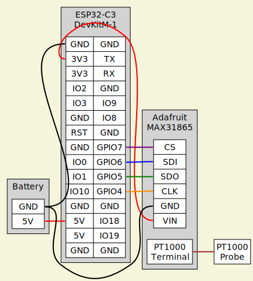

# ESP32-C3 PT1000 BLE temperature probe

Arduino project to provide PT1000 temperature readings over Bluetooth Low Energy.
Using an [ESP32-C3-DevKitM-1](https://docs.espressif.com/projects/esp-idf/en/latest/esp32c3/hw-reference/esp32c3/user-guide-devkitm-1.html) and the [Adafruit MAX31865](https://www.adafruit.com/product/3648).

The firmware advertises a BLE service with UUID `621ABF0E-E642-40D8-B766-8D910900B1C5` containing characteristic `E33E3DC8-BCB7-476A-8D26-1B6D968F615C` which supports `read` and `notify`.
This characteristic provides the measured temperature in °C and the time since boot in seconds in the format `${time} ${temp}` encoded as ASCII.

The data can be easily logged with the included [script](log.py).

## Circuit Diagram

